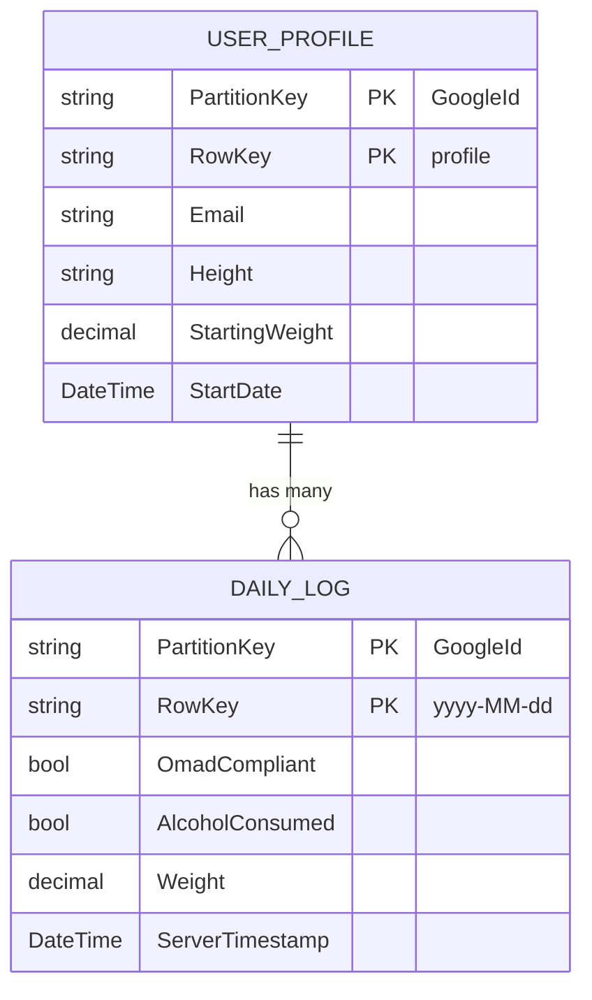

# Data Model: PoOmad

**Date**: 2025-11-22  
**Purpose**: Phase 1 data model design for Azure Table Storage schema

---

## Overview

PoOmad uses Azure Table Storage for cost-effective NoSQL persistence. The schema is optimized for single-user access patterns, partitioning all data by `UserId` (Google account ID) to enable efficient queries within a user's data.

---

## Entities

### 1. User Profile

**Purpose**: Stores baseline metrics for weight tracking

**Table Name**: `UserProfiles`

| Field | Type | Description | Constraints |
|-------|------|-------------|-------------|
| **PartitionKey** | `string` | User's Google account ID | Required, immutable |
| **RowKey** | `string` | Fixed value: `"profile"` | Required, immutable |
| **Email** | `string` | User's email from Google OAuth | Required, from OAuth claims |
| **Height** | `string` | Height in user's preferred format | Required, validated by `ProfileValidator` |
| **StartingWeight** | `decimal` | Initial weight when profile created | Required, 50-500 lbs range (FR-005) |
| **StartDate** | `DateTime` | UTC timestamp of profile creation | Required, auto-generated |
| **Timestamp** | `DateTimeOffset` | Azure Table Storage system timestamp | Auto-managed by Azure |

**Access Patterns**:
- Get profile for user: `PartitionKey = {GoogleId} AND RowKey = 'profile'`
- Update profile: Same as get (single entity update)

**Validation Rules** (FluentValidation in `PoOmad.Shared`):
```csharp
// ProfileValidator.cs
RuleFor(x => x.Height)
    .NotEmpty()
    .Must(BeValidHeight).WithMessage("Height must be between 4'0\" and 7'0\" (or 122-213 cm)");

// BeValidHeight implementation:
// Accepts formats: "5'10\"" (imperial) or "178cm" (metric)
// Imperial: 4'0" to 7'0" (48-84 inches, realistic human range)
// Metric: 122cm to 213cm
// Regex: ^([4-6]'([0-9]|1[01])"|7'0")$ OR ^(1[2-9][0-9]|2[0-0][0-9]|21[0-3])cm$

RuleFor(x => x.StartingWeight)
    .InclusiveBetween(50, 500).WithMessage("Weight must be between 50 and 500 lbs (FR-005)");
```

**C# Model** (`PoOmad.Api/Features/Profile/UserProfile.cs`):
```csharp
public class UserProfile : ITableEntity
{
    public string PartitionKey { get; set; } = string.Empty; // GoogleId
    public string RowKey { get; set; } = "profile";
    public string Email { get; set; } = string.Empty;
    public string Height { get; set; } = string.Empty;
    public decimal StartingWeight { get; set; }
    public DateTime StartDate { get; set; }
    public DateTimeOffset? Timestamp { get; set; }
    public ETag ETag { get; set; }
}
```

---

### 2. Daily Log Entry

**Purpose**: Stores daily OMAD compliance, alcohol consumption, and weight tracking

**Table Name**: `DailyLogs`

| Field | Type | Description | Constraints |
|-------|------|-------------|-------------|
| **PartitionKey** | `string` | User's Google account ID | Required, immutable |
| **RowKey** | `string` | Date in `yyyy-MM-dd` format | Required, immutable, no future dates (FR-015) |
| **OmadCompliant** | `bool` | Did user follow OMAD plan? | Required |
| **AlcoholConsumed** | `bool` | Did user consume alcohol? | Required |
| **Weight** | `decimal` | Current weight in pounds | Required, 50-500 lbs range (FR-005) |
| **ServerTimestamp** | `DateTime` | UTC timestamp of last write | Required, used for conflict resolution (FR-019a) |
| **Timestamp** | `DateTimeOffset` | Azure Table Storage system timestamp | Auto-managed by Azure |

**Access Patterns**:
- Get all logs for user (calendar view): `PartitionKey = {GoogleId}` (range query)
- Get specific day: `PartitionKey = {GoogleId} AND RowKey = '2025-11-22'`
- Get date range (analytics): `PartitionKey = {GoogleId} AND RowKey >= '2025-10-01' AND RowKey <= '2025-11-30'`

**Validation Rules** (FluentValidation in `PoOmad.Shared`):
```csharp
// DailyLogValidator.cs
RuleFor(x => x.RowKey)
    .Must(NotBeFutureDate).WithMessage("Cannot log dates in the future (FR-015)");

RuleFor(x => x.Weight)
    .InclusiveBetween(50, 500).WithMessage("Weight must be between 50 and 500 lbs (FR-005)");

// Context-dependent validation (requires previous weight)
RuleFor(x => x.Weight)
    .Must((log, weight, context) => {
        var previousWeight = context.RootContextData["PreviousWeight"] as decimal?;
        if (previousWeight == null) return true; // First entry
        return Math.Abs(weight - previousWeight.Value) <= 5; // FR-017a
    })
    .WithMessage("Weight change exceeds 5 lbs. Please confirm this entry is correct (FR-017b)");
```

**C# Model** (`PoOmad.Api/Features/DailyLogs/DailyLogEntry.cs`):
```csharp
public class DailyLogEntry : ITableEntity
{
    public string PartitionKey { get; set; } = string.Empty; // GoogleId
    public string RowKey { get; set; } = string.Empty;        // yyyy-MM-dd
    public bool OmadCompliant { get; set; }
    public bool AlcoholConsumed { get; set; }
    public decimal Weight { get; set; }
    public DateTime ServerTimestamp { get; set; }
    public DateTimeOffset? Timestamp { get; set; }
    public ETag ETag { get; set; }
}
```

---

### 3. Streak (Calculated - Not Stored)

**Purpose**: Represents consecutive days of OMAD compliance for motivational tracking

**Calculation Logic**:
- Query all logs for user ordered by date descending
- Start from most recent logged date, count backwards while `OmadCompliant = true`
- Reset counter when first `OmadCompliant = false` is encountered
- **Unlogged days DO NOT break streak** - only logged non-compliant days break streak
- User can log any past date (backfilling) without breaking current streak

**C# Implementation** (`PoOmad.Api/Features/DailyLogs/CalculateStreak.cs`):
```csharp
public class CalculateStreakQuery : IRequest<int>
{
    public string UserId { get; init; } = string.Empty;
}

public class CalculateStreakHandler : IRequestHandler<CalculateStreakQuery, int>
{
    private readonly TableClient _tableClient;

    public async Task<int> Handle(CalculateStreakQuery request, CancellationToken ct)
    {
        var logs = _tableClient.Query<DailyLogEntry>(
            filter: $"PartitionKey eq '{request.UserId}'",
            cancellationToken: ct
        ).OrderByDescending(log => log.RowKey) // yyyy-MM-dd sorts chronologically
         .ToList();

        int streak = 0;
        // Start from most recent logged date and count backwards
        // Unlogged days are skipped (don't break streak)
        // Only logged OmadCompliant=false breaks the streak
        foreach (var log in logs)
        {
            if (!log.OmadCompliant) break; // FR-010: Reset on logged non-compliant day
            streak++;
        }
        return streak;
    }
}
```

**Performance Note**: For users with >1 year of data, consider caching streak value in `UserProfile` and updating incrementally instead of recalculating on each dashboard load.

---

## Relationships



**Relationship Notes**:
- 1:N relationship between User Profile and Daily Logs
- No foreign key constraints (NoSQL model)
- Relationship enforced via `PartitionKey` (all logs for a user share same PartitionKey)

---

## Data Migration & Seeding

### Initial Setup
1. Create Azure Table Storage account via Aspire (or Azurite locally)
2. Tables auto-created on first write (no explicit schema definition needed)

### Test Data Generation
Create seed script (`scripts/seed-test-data.ps1`) to generate realistic data:
- 90 days of daily logs per user
- 80% OMAD compliance (random distribution)
- 20% alcohol consumption (random distribution)
- Weight trend: Starting weight - 10 lbs over 90 days (linear + random noise ±2 lbs)

### Production Data Retention
- **Retention Policy**: Indefinite per clarification (FR-022)
- **User Deletion**: Implement cascading delete (delete profile + all logs when user deletes account per FR-023)

---

## Query Optimization

### Efficient Queries (Single Partition)
✅ **Good**: `PartitionKey = {GoogleId}` → All user data in one partition  
✅ **Good**: `PartitionKey = {GoogleId} AND RowKey = '2025-11-22'` → Single entity  
✅ **Good**: `PartitionKey = {GoogleId} AND RowKey >= '2025-10-01'` → Date range within partition  

### Inefficient Queries (Cross-Partition - Avoid)
❌ **Bad**: `OmadCompliant = true` → Scans all partitions  
❌ **Bad**: `Weight < 180` → Scans all partitions  

**Rationale**: All PoOmad queries are user-scoped, so partition-based queries are always efficient. Global analytics (e.g., "average weight loss across all users") would require Azure Functions + background aggregation, not in MVP scope.

---

## Offline Sync Schema Considerations

**Conflict Resolution Field**: `ServerTimestamp` (FR-019a)
- Client writes include timestamp from their local clock
- Server compares `ServerTimestamp` on write: if client timestamp > existing timestamp, accept write
- Client refreshes data after sync to ensure consistency

**IndexedDB Schema** (Client-side cache):
- Mirror Table Storage schema in browser's IndexedDB
- Queue pending writes in `PendingWrites` table
- On reconnect, flush queue to server

---

## Compliance Mapping

| Constitutional Requirement | Implementation |
|---------------------------|----------------|
| **Data Isolation (FR-002)** | PartitionKey = GoogleId ensures user data isolation |
| **5 lb Threshold (FR-017b)** | FluentValidation rule with context-dependent previous weight comparison |
| **No Future Dates (FR-015)** | FluentValidation rule comparing RowKey to DateTime.UtcNow |
| **Indefinite Retention (FR-022)** | No TTL policy on tables; data persists until user-initiated deletion |
| **Last-Write-Wins (FR-019a)** | ServerTimestamp field for conflict resolution |

---

## Next Steps

- ✅ **Phase 0**: Research completed
- ✅ **Phase 1.1**: Data model documented (this file)
- 🔄 **Phase 1.2**: Generate API contracts (contracts/ folder)
- 🔄 **Phase 1.3**: Generate quickstart guide
- ⏭️ **Phase 2**: Generate tasks (via `/speckit.tasks`)
